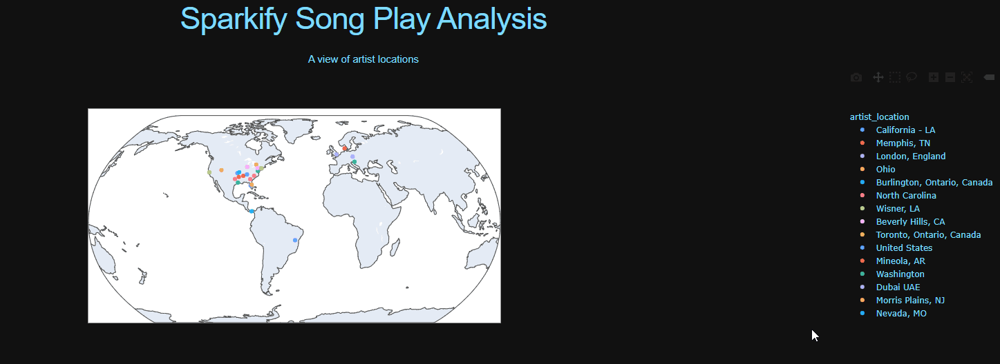

# Data Modeling With Postgres

## Project
This project is meant to provide a data pipeline that allows for the (fictitious) Sparkify analytics team to query JSON logs in order to analyze user activity on their music streaming app.

## Libraries and Technology Used
- For ETL: Python - Pandas and psycopg2
- For visualization: Plotly and Dash
- Database: PostgreSQL

## Star Schema
The star schema was chosen because the sparkify database is an OLAP system that isn't complex. As queries are ran by the Sparkify analytics team, having to use fewer joins will come in handy if the database were to use a large data set. 

## Files Used
### create_tables.py
We create an idempotent script that:
- Drops the sparkify database if it already exists and then creates the sparkify database.
- Connects to the database and gets the cursor object so we can execute PostgreSQL commands in a database session.
- Drop all the tables and then create all the tables (SQL commands are in a sepearate file so we import the queries from that file).
- To end we close the connection.

### sql_queries.py
Create an idempotent script that contains all our SQL queries:
1. Drop all fact and dimension tables.
2. Create our fact table "songplays" and dimension tables "users", "songs", "artists", and "time".
3. Create insert queries that allow us to take in data from the log files and insert into our Postgres tables.
4. Construct a query to put song id and artist id in the same table.
5. Construct a query for finding artists location based on their latitude and longitude.
6. Create a list of create and drop table queries to make query running iteratable. 

### etl.py
Create a script to read and process files from song_data and log_data and then load them into the star schema.

### app.py
A simple data visualization that takes data from the transformed data in the sparkify database and connects it to a simple scatter plot over an interactive world map.
1. Load in the data from a query of the sparkify database.
2. Plot the data from the query over an interactive map of the world and adds in a title and subtitle.
The app will run on "http://127.0.0.1:8050" in your browser. You can click and drag the world map to move to center new locations, zoom in on particular artist locations, and filter out locations.

### test.ipynb
A workbook that allows us to query our star schema and check if data has been successfully processed and loaded.

## Running The Files
The files should be run in this order:
1. create_tables.py
2. etl.py
3. app.py

Doing these 3 steps will create the database and tables (if they don't exist), process the datasets and insert them into each table, process data from tables and display a scatter plot of locations on a world map. 

